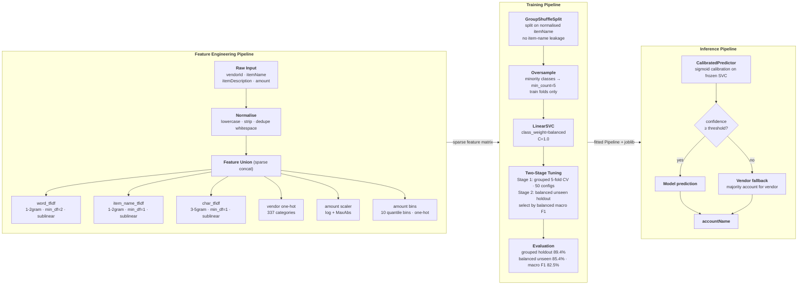

# Expense Account Classifier

**89.4% grouped holdout accuracy on 103 account categories - 14.6 points above the naive vendor-lookup baseline - with a validated rare-class benchmark showing 85.4% accuracy across 64 minority categories.**

---

## Deliverables

| File | Description |
|---|---|
| `notebooks/expense_classification_report.ipynb` | End-to-end interactive report: EDA, feature engineering, training, evaluation, overfitting diagnosis |
| [`description.md`](description.md) | Written description of approach, design decisions, results, and limitations |
| `README.md` | This file - setup and run instructions |
| `src/` | Python package: feature engineering, training, inference, MLflow tracker |
| `artifacts/evaluation_summary.json` | Full metrics from the last pipeline run |
| `artifacts/account_classifier.joblib` | Serialised trained model |

---

## Results

| Evaluation Method | Accuracy | Macro F1 | Notes |
|---|---|---|---|
| Grouped holdout (80/20, item-name split) | **89.38%** | 76.4% | Primary metric - zero item-name leakage |
| Repeated grouped (5x, averaged) | **87.46%** | - | Variance-stabilised estimate |
| Random holdout (80/20) | 89.48% | 77.6% | Optimistic - included for reference only |
| **Balanced unseen holdout** | **85.42%** | **82.5%** | Stress test: 3 unseen examples x 64 rare categories |
| Baseline (vendor+item lookup) | 74.77% | - | Naive memorisation baseline |

> The grouped holdout is the honest number. It simulates production: the model sees a new expense whose item name never appeared in training and must generalise from vendor, amount, and text patterns alone.

---

## Architecture



**Model**: `LinearSVC` wrapped in a scikit-learn `Pipeline`

**Feature union** (all sparse, concatenated):

| Feature | Transformer | Signal |
|---|---|---|
| `itemName` + `itemDescription` (word 1-2gram) | TF-IDF, min_df=2, sublinear | Dominant text signal |
| `itemName` only (word 1-2gram) | TF-IDF, min_df=1, sublinear | Dedicated rare-item signal |
| Combined text (char 3-5gram) | TF-IDF, min_df=1, sublinear | Typo + partial-match robustness |
| `vendorId` | One-hot (337 categories) | Vendor → account priors |
| `itemTotalAmount` | Log-scaled + MaxAbs | Amount range signal |
| `itemTotalAmount` | Quantile bins (10), one-hot | Non-linear amount bucket signal |

**Hyperparameter selection**: two-stage tuning —
1. 50-config grouped 5-fold CV grid (C × class_weight × oversample_min_count) to identify production-viable configs (grouped accuracy floor ≥ 0.85)
2. All eligible configs re-evaluated on the balanced unseen holdout; best selected by **balanced macro F1**

> Key insight: `class_weight='balanced'` is anti-correlated with grouped CV macro F1 but optimal for rare-class balanced accuracy. Stage 1 must not rank by grouped macro F1 before Stage 2 evaluates rare-class performance.

**Production params selected**: `C=1.0`, `class_weight='balanced'`, `oversample_min_count=5`

**Inference**: `CalibratedPredictor` - sigmoid-calibrated confidence scores with vendor-majority fallback when model confidence falls below threshold.

---

## Project Structure

```
src/
  feature_engineering_pipeline.py  # Data loading, text normalisation, feature transformers
  training_pipeline.py             # Model training, evaluation, tuning, diagnostics
  inference_pipeline.py            # CalibratedPredictor, save/load, predict API
  tracker.py                       # MLflow integration: tracking, registry, tracing, one-click retrain
tests/
  test_model.py                    # Pipeline, tuning, and evaluation tests
  test_data.py                     # Data loading and normalisation tests
  test_tracker.py                  # MLflow tracker tests
artifacts/
  evaluation_summary.json          # Full metrics from last pipeline run
  account_classifier.joblib        # Serialised trained model
mlruns/                            # Local MLflow experiment store (file backend, gitignored)
.docs/
  01_plan.md                       # Initial plan
  02_eda.md                        # EDA findings
  03_results.md                    # Auto-generated results report
  04_tutorial.md                   # End-to-end tutorial
  05_mlflow.md                     # MLflow tracker usage guide
  05_split_strategy_review.md      # Validation strategy analysis
  06_rare_class_improvements.md    # Rare-class tuning decisions and rationale
```

---

## Setup and Run Instructions


<!-- https://github.com/user-attachments/assets/4e3e777b-f739-4a9f-b67c-63d5e60c158a -->


### Requirements

- Python 3.14+
- [uv](https://docs.astral.sh/uv/getting-started/installation/) package manager

### Install uv

**Linux / macOS**
```bash
curl -LsSf https://astral.sh/uv/install.sh | sh
```

**Windows (PowerShell)**
```powershell
powershell -ExecutionPolicy ByPass -c "irm https://astral.sh/uv/install.ps1 | iex"
```

---

### Install dependencies

**Linux / macOS**
```bash
uv sync
```

**Windows**
```powershell
uv sync
```

_(same command - uv is cross-platform)_

---

### Train the model

Runs the full pipeline: loads data, engineers features, tunes hyperparameters, evaluates, saves the model, and opens the MLflow dashboard at `http://127.0.0.1:5000`.

**Linux / macOS**
```bash
uv run main.py
```

**Windows**
```powershell
uv run main.py
```

**Without MLflow tracking** (no server needed):

```bash
# Linux / macOS
uv run main.py --no-track

# Windows
uv run main.py --no-track
```

Outputs written after a run:

| Path | Contents |
|---|---|
| `artifacts/evaluation_summary.json` | Full metrics JSON |
| `artifacts/account_classifier.joblib` | Serialised trained model |
| `.docs/03_results.md` | Auto-generated formatted results report |
| `mlflow.db` + `mlartifacts/` | MLflow backend and artifact store |

---

### Run the test suite

**Linux / macOS**
```bash
uv run pytest
```

**Windows**
```powershell
uv run pytest
```

---

### Open the notebook

**Linux / macOS**
```bash
uv run jupyter notebook notebooks/expense_classification_report.ipynb
```

**Windows**
```powershell
uv run jupyter notebook notebooks\expense_classification_report.ipynb
```

The notebook reads `artifacts/evaluation_summary.json` (produced by `uv run main.py`) and the MLflow query cell auto-detects a running server or falls back to the local file store.

---

### MLflow commands

| Command | What it does |
|---|---|
| `uv run main.py` | Auto-start server + full tracked training run |
| `uv run main.py --run-name my-run` | Same with a custom run name |
| `uv run python -m src.tracker server` | Start MLflow server only (foreground) |
| `uv run python -m src.tracker retrain` | Retrain with tracking (server must be running) |

Dashboard URL: `http://127.0.0.1:5000`

**Load the champion model from Python:**

```python
from src.tracker import MLflowTracker
model = MLflowTracker().load_model("champion")
predictions = model.predict(list_of_feature_dicts)
```

---

## Validation Design

Three complementary evaluation methods, each measuring a different thing:

- **Random holdout** - upper-bound optimistic estimate; same item names can appear in both train and test
- **Grouped holdout** - honest production estimate; `GroupShuffleSplit` on normalised `itemName` ensures zero item-name overlap between train and test
- **Balanced unseen holdout** - rare-class stress test; holds out exactly 3 examples per eligible label (64 labels), all item names strictly unseen in training

The gap between random (90.5%) and grouped (87.5%) repeated means - **~3 points** - directly quantifies the duplicate leakage that row-level splits miss.
